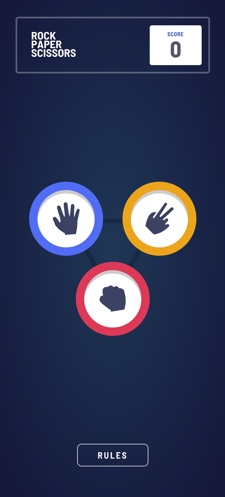
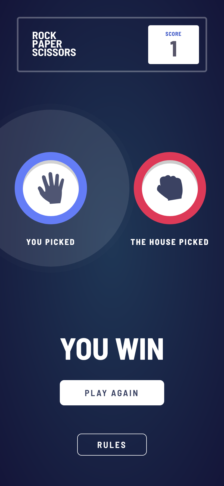
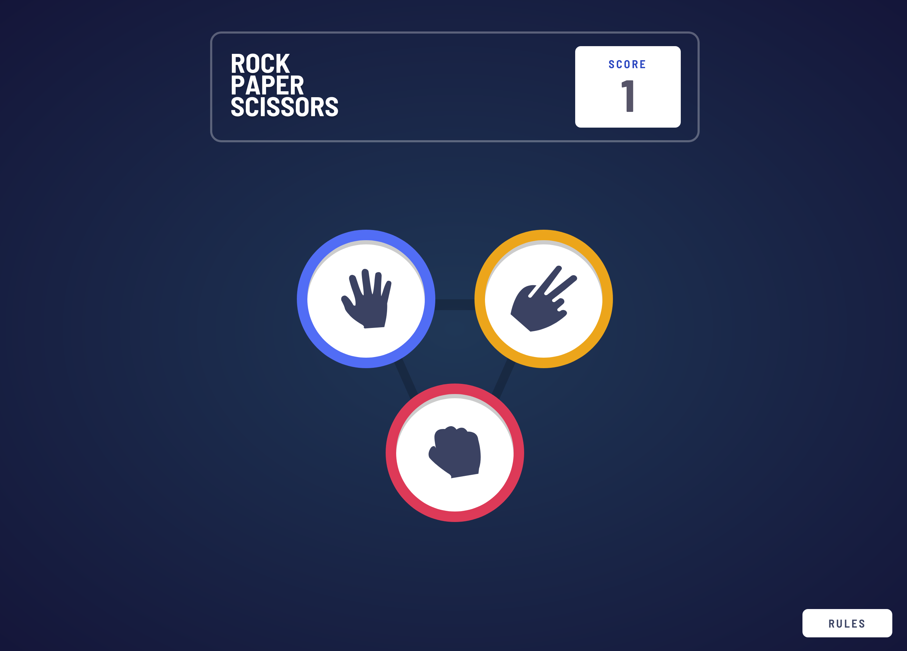
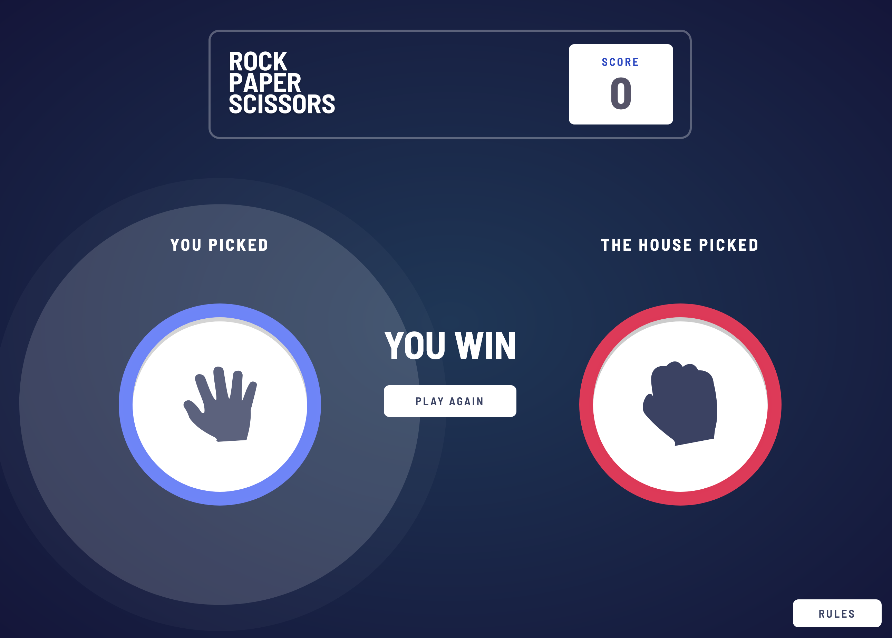

# Frontend Mentor - Rock, Paper, Scissors solution

This is a solution to the [Rock, Paper, Scissors challenge on Frontend Mentor](https://www.frontendmentor.io/challenges/rock-paper-scissors-game-pTgwgvgH). Frontend Mentor challenges help you improve your coding skills by building realistic projects.

## Table of contents

- [Overview](#overview)
  - [The challenge](#the-challenge)
  - [Screenshot](#screenshot)
  - [Links](#links)
- [Built with](#built-with)
- [Author](#author)

## Overview

### The challenge

Users should be able to:

- View the optimal layout for the game depending on their device's screen size
- Play Rock, Paper, Scissors against the computer
- Maintain the state of the score after refreshing the browser 

### Screenshot

### Links

- Solution URL: [https://github.com/gdcristea/fun-game](https://github.com/gdcristea/fun-game)
- Live Site URL: [Add live site URL here](https://your-live-site-url.com)

### Built with

**Core Technologies**
- Semantic HTML5
- SCSS with custom properties
- CSS Flexbox
- Mobile-first design

**Framework & Architecture**
- Angular (with Standalone Components)
- Angular Signals
- LocalStorage for score persistence

**Component Design**
- Modular structure using custom components (`<app-option>`, `<app-score>`, etc.)
- Animation with CSS (pulsing effect)
- Dynamic game logic using timeouts and state signals

## Author

- Website - work in progress.
- Frontend Mentor - [Daniel Cristea](https://www.frontendmentor.io/profile/gdcristea)
- LinkedIn - [Daniel Cristea](https://www.linkedin.com/in/daniel-cristea-629069191/)
